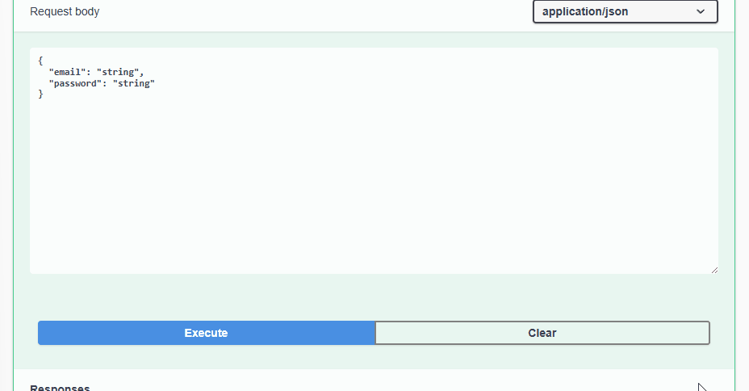
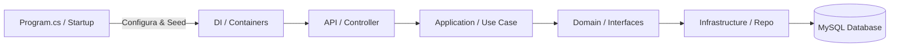
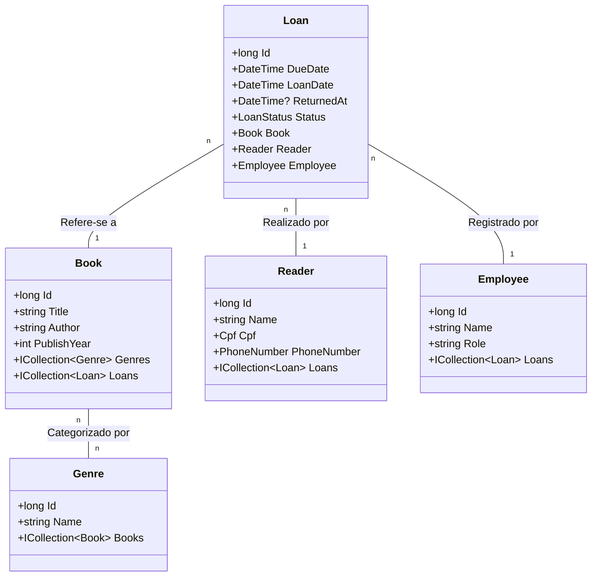

# LibraryOn
O **LibraryOn** é uma API desenvolvida em **C# / .NET 8** que simula o funcionamento de uma biblioteca online.  
O projeto foi estruturado para representar um fluxo real de biblioteca, com controle de usuários, funcionários, livros e empréstimos, utilizando uma arquitetura em camadas bem definida.

A aplicação foi pensada para ser facilmente integrada a outros clientes (WPF, aplicações web ou outros sistemas).

<p align="center">
  
  
  
  
</p>

---

## 🧠 Objetivo do projeto

- Consolidar conhecimentos em desenvolvimento backend com .NET
- Aplicar princípios de organização de código e separação de responsabilidades
- Demonstrar uso prático de EF Core com banco de dados relacional
- Aplicar padrões de projeto como Repository, Unit of Work e DTO
- Servir como projeto de portfólio profissional

---

## 🕹️ Demonstração

Aqui está uma breve demonstração do fluxo de login e consulta de livros através do Swagger:

<p align="center">
  
</p>

---

## 🏛️ Arquitetura e Fluxo

A solução implementa uma abordagem de **Clean Architecture** simplificada, garantindo o desacoplamento entre a lógica de negócio e as implementações técnicas.

<details>
  <summary><b>📂 Detalhes da Organização em Camadas</b></summary>

A solução está dividida nos seguintes projetos:
- **API**: Porta de entrada. Gerencia requisições HTTP, middlewares, autenticação e filtros globais.
- **Application**: Casos de uso, validações (**FluentValidation**) e mapeamentos (**AutoMapper**).
- **Domain**: Entidades, Enums e os contratos (interfaces) de repositórios e Unit of Work.
- **Infrastructure**: Implementação de acesso a dados (**DbContext**), Repositórios, Migrations e serviços de infraestrutura.
- **Communication**: DTOs (Data Transfer Objects) para padronizar a entrada e saída de dados.
- **Exception**: Centralização de mensagens de erro e exceções customizadas.
</details>

<details>
  <summary><b>🔄 Ciclo de Vida e Fluxo da Aplicação</b></summary>

O fluxo foi projetado para ser automatizado e seguir uma hierarquia clara, desde a inicialização até a execução das requisições:

1. **Inicialização e DI**: A aplicação inicia em `Program.cs` (projeto `LibraryOn.Api`), onde as dependências são registradas via `AddInfrastructure()` e `AddApplication()`.
2. **Startup Automatizado**: Ao subir a API, as **Migrations** são aplicadas automaticamente e um usuário **Administrador Inicial (Seed)** é criado para garantir o acesso imediato.
3. **Fluxo de Requisição**:
   - **API (Controller)** recebe a requisição.
   - **Application (Use Case)** executa a regra de negócio e validações.
   - **Domain (Interfaces)** define o contrato de dados.
   - **Infrastructure (Repo)** persiste as informações no **MySQL** via **EF Core**.


</details>

---

## ⚙️ Padrões e práticas adotadas

- Injeção de dependência (Microsoft DI)
- Repository Pattern
- Unit of Work
- DTOs para entrada e saída
- AutoMapper
- FluentValidation
- Autenticação com JWT
- Filtro global de exceções

---

## 📄 Status do projeto

O projeto encontra-se em **fase final de desenvolvimento**.

A arquitetura, os principais fluxos de negócio e a estrutura geral da aplicação já estão consolidados.  
Neste momento, o objetivo do repositório é servir como **projeto de portfólio**, demonstrando domínio de organização de código, arquitetura em camadas, uso de padrões e integração com banco de dados.

**Novas funcionalidades não estão previstas, sendo realizados apenas eventuais ajustes ou correções finais.**

---

## ✅ Funcionalidades já implementadas

- API REST desenvolvida com ASP.NET Core (.NET 8)
- Arquitetura em camadas (API, Application, Domain, Infrastructure, Communication e Exception)
- Casos de uso organizados por domínio
- CRUD das principais entidades do sistema
- Persistência de dados com Entity Framework Core
- Banco de dados MySQL (Pomelo)
- Migrations configuradas e aplicadas automaticamente no startup
- Seed automático de usuário administrador
- Autenticação baseada em JWT
- Uso de DTOs para entrada e saída de dados
- Validações com FluentValidation
- Mapeamentos com AutoMapper
- Repository Pattern e Unit of Work
- Tratamento global de exceções
- Swagger habilitado em ambiente de desenvolvimento

Essas funcionalidades atendem ao escopo proposto inicialmente para o projeto e representam o conjunto final de entregas do LibraryOn.


---

## 🛠️ Tecnologias Utilizadas

- C#
- ASP.NET Core Web API (.NET 8)
- Entity Framework Core
- MySQL (Pomelo)
- Swagger / OpenAPI
- AutoMapper
- FluentValidation
- JWT
- Git e GitHub

---

## 📁 Estrutura do Projeto
```
├── src/
│ ├── LibraryOn.Api # Controllers, middlewares e configuração da API
│ ├── LibraryOn.Application # Casos de uso, validações, mapeamentos e DI
│ ├── LibraryOn.Communication # DTOs de requests e responses
│ ├── LibraryOn.Domain # Entidades, enums e contratos
│ ├── LibraryOn.Exception # Exceções e mensagens centralizadas
│ └── LibraryOn.Infrastructure # DbContext, repositórios, migrations, seed e serviços
├── tests/ # Projetos de teste (ex.: Validators.Tests)
├── LibraryOn.sln
└── README.md
```
---

## 📊 Modelo de Domínio


---
## 💾 Banco de Dados

- Banco relacional: **MySQL**
- ORM: **Entity Framework Core**
- Provider: **Pomelo.EntityFrameworkCore.MySql**
- Estrutura versionada por migrations
- Migrations aplicadas automaticamente no startup da aplicação
- DbContext central: `LibraryOnDbContext`

---

## 🔐 Autenticação

- Autenticação baseada em JWT Bearer.
- Geração de token feita por serviço registrado na camada Infrastructure.
- Configurações lidas via `appsettings.json` ou variáveis de ambiente.

---
## 🧪 Observabilidade e suporte ao desenvolvimento

- Swagger habilitado em ambiente de desenvolvimento
- Filtro global de exceções configurado
- Uso de `ILogger` no processo de seed do administrador

---

## ▶️ Como executar o projeto

A partir da raiz do repositório:

```bash
dotnet restore
dotnet build
dotnet run --project src/LibraryOn.Api
```
### ⚙️ Configurações obrigatórias

String de conexão

Chave obrigatória:
```bash
  ConnectionStrings:connection
```
Configurações de JWT
```bash
  Settings:Jwt:SigningKey
  Settings:Jwt:ExpiresMinutes
```
Seed do administrador (opcional, recomendado)
```bash
Variáveis de ambiente: 
INITIAL_ADMIN_EMAIL
INITIAL_ADMIN_PASSWORD
```
Essas variáveis são utilizadas para criar automaticamente o usuário administrador na primeira execução.


---
## 🔑 Exemplo de Endpoint — Login **Endpoint**

<details>
<summary><b>Ver JSON de exemplo (Request/Response)</b></summary>

```
http POST /api/Login
```
**Request body**
```json
{
  "email": "admin@libraryon.com",
  "password": "senhaforte123"
}
```
**Curl**
```
curl -X 'POST' \
  'http://localhost:5068/api/Login' \
  -H 'accept: text/plain' \
  -H 'Content-Type: application/json' \
  -d '{
  "email": "admin@libraryon.com",
  "password": "senhaforte123@"
}'
```
**Request URL**
```
http://localhost:5068/api/Login

```
### ✅ Response 200 (OK)

```json
{
  "name": "Administrador",
  "token": "eyJhbGciOiJIUzI1NiIsInR5cCI6IkpXVCJ9...",
  "mustChangePassword": true
}
```
### ❌ Response 400 (Bad Request)

```json
{
  "errorMessages": [
    "string"
  ]
}
```

</details>

---

## 🧪 Testes

Os projetos de teste encontram-se no diretório:
```bash
tests/
```
Para executar:
```bash
dotnet test
```